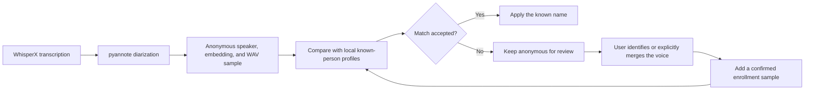

# Lorraine

Lorraine is a local-first Flutter meeting recorder for macOS. It captures the Mac's system audio and microphone into one retained recording, submits a transcription-optimized copy to an authenticated Modal deployment running WhisperX, and stores the returned speaker-labelled transcript locally.

It also tries to recognize the same person across meetings. Every anonymous speaker gets a normalized voice embedding and a short WAV sample; once you identify a voice with a name and email, that embedding is enrolled on a local profile and later meetings are matched against it, so regulars stop coming back as `SPEAKER_00`. See [Recognize the same person across meetings](#recognize-the-same-person-across-meetings).

Summaries are optional and run against whichever provider you choose in Settings. The default is Gemma on a local Ollama server, which keeps transcripts on your Mac; picking a hosted provider instead is a deliberate, reversible choice you make — see [Choose a summarization provider](#choose-a-summarization-provider).

## What works

- macOS 15+ system audio and microphone capture via ScreenCaptureKit
- durable local M4A recordings and JSON-backed meeting history
- asynchronous Modal upload, processing, polling, retry, and failure states
- transcription-optimized audio with checksummed, retriable chunk uploads
- automatic idempotent Modal deployment on app startup through the authenticated CLI
- WhisperX large-v3 transcription, alignment, and pyannote diarization on an A10G GPU
- anonymous speaker labels, short voice samples, and normalized speaker embeddings
- **recurring speakers recognized across separate meetings** from enrolled local voice profiles, so people you have named once are matched automatically in later sessions
- enrollment-aware cosine-similarity matching that improves as a profile accumulates confirmed samples
- Markdown meeting summaries from a provider **you** select: Ollama (local, the default), OpenAI, any OpenAI-compatible endpoint, Anthropic, or OpenRouter

The Flutter shell is generated for Windows and Linux as well, but recording is deliberately reported as unsupported there until equivalent WASAPI/PipeWire loopback bridges are added.

## Run the app

Requirements:

- Flutter 3.41 or newer
- Xcode with macOS 15 SDK or newer
- macOS microphone and Screen Recording permission

```sh
flutter pub get
flutter run -d macos
```

On first recording, macOS asks for Screen Recording and microphone permission. Lorraine does not capture or save video; Screen Recording permission is required by ScreenCaptureKit to receive system audio.

## Deploy transcription

Follow the one-time authentication and secret setup in [backend/README.md](backend/README.md). On each startup, Lorraine runs `modal token info` followed by an idempotent `modal deploy`, discovers and health-checks the `modal.run` URL, and stores it in Settings. Modal treats unchanged deployments as no-ops. Settings also provides deployment status, a manual URL fallback, and a **Deploy now** retry.

The original recording remains on the Mac. A temporary compressed derivative and known-profile embeddings are sent to Modal. The backend deletes the uploaded audio after successful transcription while retaining the JSON job result in its Modal Volume. Upload and job endpoints require a bearer token stored in the `lorraine-api-auth` Modal secret; the service fails closed if that key is absent.

## Choose a summarization provider

**Whether your meeting transcripts leave this Mac is your decision, and only yours.** Lorraine ships with Ollama selected, so out of the box every summary is generated locally and no transcript text is transmitted anywhere. Nothing changes that until you deliberately pick a different provider in Settings and enter a key. Lorraine will never switch providers on your behalf, fall back to a cloud model when the local one is unavailable, or send a transcript to a service you did not choose.

The tradeoff is real in both directions, which is why it is a choice rather than a default we made for you: a hosted frontier model usually writes a better summary than a 4B model running on your laptop, and a local model keeps a potentially sensitive conversation on hardware you control. Which of those matters more depends on the meeting, and you may reasonably answer differently for different ones — the provider setting can be changed at any time.

Settings has a **Summarization** card with a provider picker. Each provider keeps its own base URL, model, and API key, so switching between them does not discard the others' settings.

| Provider | Default base URL | Transport |
| --- | --- | --- |
| Ollama (on this Mac) | `http://localhost:11434` | `/api/generate` |
| OpenAI | `https://api.openai.com/v1` | `/chat/completions` |
| OpenAI-compatible endpoint | `http://localhost:1234/v1` | `/chat/completions` |
| Anthropic | `https://api.anthropic.com/v1` | `/messages` |
| OpenRouter | `https://openrouter.ai/api/v1` | `/chat/completions` |

OpenRouter and OpenAI-compatible servers (LM Studio, vLLM, llama.cpp, Together, Groq) share the OpenAI chat-completions dialect, so they use one transport and differ only in defaults and attribution headers. Anthropic's Messages API does not follow that dialect — it uses `x-api-key`, an `anthropic-version` header, a top-level `system` string, and a content-block response — so it has its own request path.

Ollama is the only provider Lorraine *treats* as local: selecting anything else shows an upload warning under a red icon next to the key field, and the meeting button changes from **Summarize locally** to **Summarize**. That warning is deliberately conservative. If you point the OpenAI-compatible option at a server on this machine — LM Studio and llama.cpp both default to `localhost` — your transcript does stay put, but Lorraine cannot verify that from a URL and warns anyway. Judge by the base URL you entered, not by the label.

If you pick a cloud provider, that provider's own retention and training policies then govern your transcript, not this README. Check them before summarizing meetings you would not want retained.

### Ollama

Install [Ollama](https://ollama.com), then run:

```sh
ollama serve
```

Lorraine checks for the configured model only when a summary is requested. If it is missing, Lorraine downloads it through Ollama and displays pull progress before generating the summary.

### Cloud providers

Paste the provider's key into the API key field. OpenAI-compatible servers may leave it empty when they do not authenticate. Keys are stored in the same unencrypted `state.json` as the Modal API key — see [Data and privacy](#data-and-privacy).

## Recognize the same person across meetings

**Lorraine tries to match a voice it hears today against people you identified in earlier meetings, so recurring participants get named automatically instead of showing up as `SPEAKER_00` every week.**

The mechanism is enrollment, not magic. The first time an unknown voice appears you give it a name and email; that meeting's voice embedding is saved as a confirmed sample on that person's local profile. Every later meeting compares its speakers against those stored profiles, and each further identification you confirm adds another sample, so a profile gets more reliable the more meetings that person attends.

Profiles are stored on this Mac and are not shared between users or installs. They are not, however, confined to it: each known person's id, **name**, and voice embeddings are uploaded to your Modal deployment with every transcription so the matching can run there against that meeting's speakers. Email addresses and the saved WAV samples are never sent — they stay on this Mac.

Recognition is a suggestion, never proof of identity. A match can be wrong, and the guardrails below exist because it sometimes is: automatic matches deliberately do not enroll themselves, so one bad match cannot compound across future meetings. Review the names on a transcript before treating them as a record of who said what.

### Matching flow



For each diarized speaker, Modal compares the normalized embedding with both the normalized centroid and every confirmed sample in each known-person profile. The profile's score is the better of its centroid score and its best individual-sample score.

A profile is accepted when either of these rules passes:

1. **Strict match:** its score meets the configured threshold, which defaults to `0.75`. This rule also applies to profiles with only one confirmed sample.
2. **Enriched-profile match:** the profile has at least two confirmed samples, its score meets the configurable enriched-profile minimum (default `0.60`), and it leads the next-best profile by the configurable required margin (default `0.25`).

If neither rule passes, Lorraine leaves the speaker anonymous and shows the saved voice sample for manual review. The same matching logic runs locally at startup and after a user confirms an identity, allowing older anonymous speakers to be linked as profiles improve without uploading their meetings again.

Manual identity decisions are deliberately separated from automatic matches:

- Entering a name or email that matches an existing profile asks whether to merge or keep the people separate.
- An explicit identification or confirmed merge enrolls that meeting's embedding in the selected profile.
- An automatic match applies the name but does not enroll its embedding. This prevents one mistaken match from reinforcing itself in later meetings.

The enriched rule was added after a short same-speaker recording scored `0.612` against the best profile but only `0.262` against the runner-up. A strict cutoff rejected that clear relative match. A whispered enrollment was an outlier, but removing it would only have changed the best score to about `0.599`, so sample enrichment alone was not enough; the decision also needed to consider the separation from other profiles. The stricter defaults still accept that calibration case while rejecting more borderline matches. All three sensitivity values are available in Settings, and changing them re-evaluates previous automatic matches without altering manually confirmed identities.

## Data and privacy

Meeting recordings, transcripts, voice embeddings, samples, settings, and the configured API keys — the Modal key and any summarization-provider keys — are stored under the platform application-support directory. This MVP does not encrypt those files. Voice embeddings may be biometric data, so production deployment should add encrypted-at-rest storage, profile deletion/export, retention controls, consent UX, and organization-specific legal review.

Three categories of data leave this Mac, and each is worth knowing about separately:

1. **Always, for transcription:** a compressed copy of the recording, plus the id, name, and voice embeddings of every known person, go to *your own* Modal deployment. The backend deletes the uploaded audio after a successful run but keeps the JSON job result in its Modal Volume.
2. **Only if you choose a remote summarization provider:** the meeting transcript is sent to that provider. With the default Ollama setting — or an OpenAI-compatible endpoint you have pointed at this machine — nothing is. See [Choose a summarization provider](#choose-a-summarization-provider).
3. **Never:** email addresses, saved WAV voice samples, and the original recording.

Speaker recognition is probabilistic. The default strict cosine threshold is `0.75` and can be adjusted in Settings; enriched profiles can use the guarded relative-match rule described above. A match is a suggestion, not proof of identity. Whispered or very short samples, overlapping speakers, and poor-quality system audio can reduce embedding and diarization accuracy.

Recording and transcribing other people carries obligations Lorraine does not handle for you. Consent requirements vary by jurisdiction, and voice embeddings may count as biometric data — decide how you will notify participants before you record them.

## Verify

```sh
flutter analyze
flutter test
python3 -m py_compile backend/modal_app.py
flutter build macos
```

The last command requires a complete Xcode installation and CocoaPods.

## Project map

- `lib/app_controller.dart` — recording, job polling, identity, and summary workflow
- `lib/repository.dart` — local meeting/profile persistence and media locations
- `lib/services.dart` — Modal CLI startup deployment, API client, capture channel, and the summarization providers
- `macos/Runner/MeetingAudioCapture.swift` — ScreenCaptureKit capture and AVFoundation mixdown
- `backend/modal_app.py` — asynchronous FastAPI + Modal + WhisperX service
