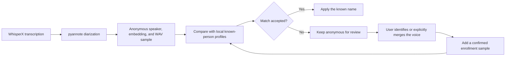

# Lorraine

Lorraine is a local-first Flutter meeting recorder for macOS. It captures the Mac's system audio and microphone into one retained recording, submits a transcription-optimized copy to an authenticated Modal deployment running WhisperX, and stores the returned speaker-labelled transcript locally.

It also keeps a normalized voice embedding and a short WAV sample for every anonymous speaker. A user can identify an unknown voice with a name and email; each explicit identification adds a confirmed embedding to that person's local voice profile. Embeddings from future meetings are compared with those profiles during transcription. Optional summaries run against Gemma through a local Ollama server.

## What works

- macOS 15+ system audio and microphone capture via ScreenCaptureKit
- durable local M4A recordings and JSON-backed meeting history
- asynchronous Modal upload, processing, polling, retry, and failure states
- transcription-optimized audio with checksummed, retriable chunk uploads
- automatic idempotent Modal deployment on app startup through the authenticated CLI
- WhisperX large-v3 transcription, alignment, and pyannote diarization on an A10G GPU
- anonymous speaker labels, short voice samples, and normalized speaker embeddings
- enrollment-aware cosine-similarity matching against multi-sample local voice profiles
- local Markdown meeting summaries using Ollama (default model: `gemma3:4b`)

The Flutter shell is generated for Windows and Linux as well, but recording is deliberately reported as unsupported there until equivalent WASAPI/PipeWire loopback bridges are added.

## Run the app

Requirements:

- Flutter 3.41 or newer
- Xcode with macOS 15 SDK or newer
- macOS microphone and Screen Recording permission

```sh
flutter pub get
flutter run -d macos
```

On first recording, macOS asks for Screen Recording and microphone permission. Lorraine does not capture or save video; Screen Recording permission is required by ScreenCaptureKit to receive system audio.

## Deploy transcription

Follow the one-time authentication and secret setup in [backend/README.md](backend/README.md). On each startup, Lorraine runs `modal token info` followed by an idempotent `modal deploy`, discovers and health-checks the `modal.run` URL, and stores it in Settings. Modal treats unchanged deployments as no-ops. Settings also provides deployment status, a manual URL fallback, and a **Deploy now** retry.

The original recording remains on the Mac. A temporary compressed derivative and known-profile embeddings are sent to Modal. The backend deletes the uploaded audio after successful transcription while retaining the JSON job result in its Modal Volume. Upload and job endpoints require a bearer token stored in the `lorraine-api-auth` Modal secret; the service fails closed if that key is absent.

## Enable local Gemma summaries

Install [Ollama](https://ollama.com), then run:

```sh
ollama serve
```

The defaults in Settings point to `http://localhost:11434` and `gemma3:4b`. Lorraine checks for the configured model only when a summary is requested. If it is missing, Lorraine downloads it through Ollama and displays pull progress before generating the summary. Summary requests never leave the local Ollama server.

## Voice identification flow



For each diarized speaker, Modal compares the normalized embedding with both the normalized centroid and every confirmed sample in each known-person profile. The profile's score is the better of its centroid score and its best individual-sample score.

A profile is accepted when either of these rules passes:

1. **Strict match:** its score meets the configured threshold, which defaults to `0.75`. This rule also applies to profiles with only one confirmed sample.
2. **Enriched-profile match:** the profile has at least two confirmed samples, its score meets the configurable enriched-profile minimum (default `0.60`), and it leads the next-best profile by the configurable required margin (default `0.25`).

If neither rule passes, Lorraine leaves the speaker anonymous and shows the saved voice sample for manual review. The same matching logic runs locally at startup and after a user confirms an identity, allowing older anonymous speakers to be linked as profiles improve without uploading their meetings again.

Manual identity decisions are deliberately separated from automatic matches:

- Entering a name or email that matches an existing profile asks whether to merge or keep the people separate.
- An explicit identification or confirmed merge enrolls that meeting's embedding in the selected profile.
- An automatic match applies the name but does not enroll its embedding. This prevents one mistaken match from reinforcing itself in later meetings.

The enriched rule was added after a short same-speaker recording scored `0.612` against the best profile but only `0.262` against the runner-up. A strict cutoff rejected that clear relative match. A whispered enrollment was an outlier, but removing it would only have changed the best score to about `0.599`, so sample enrichment alone was not enough; the decision also needed to consider the separation from other profiles. The stricter defaults still accept that calibration case while rejecting more borderline matches. All three sensitivity values are available in Settings, and changing them re-evaluates previous automatic matches without altering manually confirmed identities.

## Data and privacy

Meeting recordings, transcripts, voice embeddings, samples, settings, and the configured API key are stored under the platform application-support directory. This MVP does not encrypt those files. Voice embeddings may be biometric data, so production deployment should add encrypted-at-rest storage, profile deletion/export, retention controls, consent UX, and organization-specific legal review.

Speaker recognition is probabilistic. The default strict cosine threshold is `0.75` and can be adjusted in Settings; enriched profiles can use the guarded relative-match rule described above. A match is a suggestion, not proof of identity. Whispered or very short samples, overlapping speakers, and poor-quality system audio can reduce embedding and diarization accuracy.

## Verify

```sh
flutter analyze
flutter test
python3 -m py_compile backend/modal_app.py
flutter build macos
```

The last command requires a complete Xcode installation and CocoaPods.

## Project map

- `lib/app_controller.dart` — recording, job polling, identity, and summary workflow
- `lib/repository.dart` — local meeting/profile persistence and media locations
- `lib/services.dart` — Modal CLI startup deployment, API client, capture channel, and Ollama client
- `macos/Runner/MeetingAudioCapture.swift` — ScreenCaptureKit capture and AVFoundation mixdown
- `backend/modal_app.py` — asynchronous FastAPI + Modal + WhisperX service
